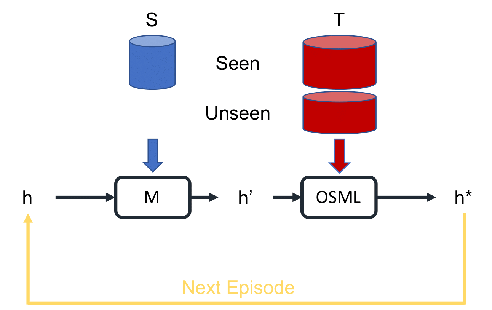

# Meta-Open 
This repository contains code for the paper:

**Few-Shot Open-Set Recognition with Meta-Learning** [[PDF](http://www.svcl.ucsd.edu/publications/conference/2020/cvpr/OpenFew.pdf)]

_IEEE Conference on Computer Vision and Pattern Recognition (CVPR), 2020_


#### Abstract
The problem of open-set recognition is considered. While previous approaches only consider this problem in the context of large-scale classifier training, we seek a unified solution for this and the low-shot classification setting. It is argued that the classic softmax classifier is a poor solution for open-set recognition, since it tends to overfit on the training classes. Randomization is then proposed as a solution to this problem. This suggests the use of meta-learning techniques, commonly used for few-shot classification, for the solution of open-set recognition. A new _oPen sEt mEta LEaRning_ (PEELER) algorithm is then introduced. This combines the random selection of a set of novel classes per episode, a loss that maximizes the posterior entropy for examples of those classes, and a new metric learning formulation based on the Mahalanobis distance. Experimental results show that PEELER achieves state of the art open set recognition performance for both few-shot and large-scale recognition. On CIFAR and miniImageNet, it achieves substantial gains in seen/unseen class detection AUROC for a given seen-class classification accuracy.

&nbsp;
<p align="center">

</p>
&nbsp;


If you find this code useful, consider citing our work:
```
@inproceedings{liu2020few,
  title={Few-Shot Open-Set Recognition using Meta-Learning},
  author={Liu, Bo and Kang, Hao and Li, Haoxiang and Hua, Gang and Vasconcelos, Nuno},
  booktitle={Proceedings of the IEEE/CVF Conference on Computer Vision and Pattern Recognition},
  pages={8798--8807},
  year={2020}
}
```

### Requirements 
* Python 3
* [PyTorch](https://pytorch.org/) (version >= 0.4.1)
* [yaml](https://pyyaml.org/wiki/PyYAMLDocumentation)


### Dataset
* mini-ImageNet
  * Download the dataset following [here](https://mega.nz/#!rx0wGQyS!96sFlAr6yyv-9QQPCm5OBFbOm4XSD0t-HlmGaT5GaiE) (from https://github.com/gidariss/FewShotWithoutForgetting).
  * Put the gzip file under `./dataset/miniImageNet`
  * `cd dataset/miniImageNet`
  * `sh prepare.sh`


### Training and Evaluating
1. Training
```
python main.py --cfg ./config/openfew/default.yaml
```

2. Testing
```
python main.py --cfg ./config/openfew/default.yaml --test
```

### Results and Models

#### Few-Shot

  | Setting                     | Accuracy | AUROC | Model |
  | ---------------------- |:-----------:|:---------:|:--------:|
  | 5-way 1-shot          | 57.90         | 62.05      | [ResNet](http://www.svcl.ucsd.edu/~liubo/metaopen/openfew.tar.gz)|

Model usage: unzip and move the entire directory under `./output`

